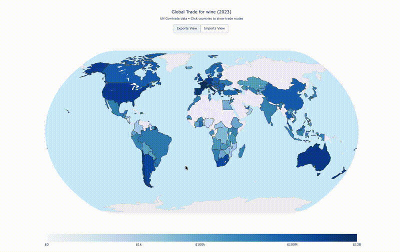

# Comtrade Trade Visualizer

An interactive visualization tool for exploring global trade data from the UN Comtrade database. Generate dynamic choropleth maps showing import/export flows for any commodity worldwide.


## Features

- **Interactive Choropleth Maps**: Color-coded world maps displaying trade values by country
- **Dual View Mode**: Toggle between exports and imports with a single click
- **Trade Flow Visualization**: Click any country to reveal trade routes to its top trading partners
- **Smart Commodity Lookup**: Search by commodity name (e.g., "wine") or HS code (e.g., "2204")
- **Hover Details**: View trade values, quantities, and top 5 trading partners on hover
- **Standalone Output**: Generates self-contained HTML files that work offline
- **Data Caching**: Automatically caches API responses to minimize redundant requests

## Demo

**[Live Demo: Global Wine Trade 2023](https://joshuaprettyman.com/documents/comtrade_wine_2023.html)** | **[Blog Post](https://joshuaprettyman.com/projects/wine-exports-viz)**



The visualization creates an interactive map where:
- Countries are shaded based on their total trade value (logarithmic scale)
- Clicking a country draws trade flow lines to all its trading partners
- Line thickness represents relative trade volume
- Hover text shows detailed trade statistics

## Installation

1. Clone the repository:
```bash
git clone https://github.com/DrPrettyman/comtrade.git
cd comtrade
```

2. Create and activate a virtual environment:
```bash
python3 -m venv .venv
source .venv/bin/activate  # On Windows: .venv\Scripts\activate
```

3. Install dependencies:
```bash
pip install -r requirements.txt
```

4. Set up your API key:
   - Register for a free API key at [UN Comtrade](https://comtradeplus.un.org/)
   - Create a `.secrets.json` file in the project root:
```json
{
    "COMTRADE_API_KEY": "your-api-key-here"
}
```

## Usage

### Command Line

Generate a trade visualization by specifying a commodity and year:

```bash
# Using commodity name
python3 src/main.py wine 2023

# Using HS code
python3 src/main.py 2204 2023
```

### Python API

```python
from src.create_viz import create_trade_visualization

# Create visualization
trade_map = create_trade_visualization("wine", 2023)

# Or with custom filename
trade_map = create_trade_visualization(2204, 2023, filename="wine_trade_2023.html")
```

### Output

The generated HTML file is saved to `~/Downloads/comtrade/plots/` and can be opened in any modern web browser.

## Project Structure

```
comtrade/
├── src/
│   ├── main.py           # CLI entry point
│   ├── create_viz.py     # Plotly visualization builder
│   ├── get_data.py       # Data fetching and processing
│   ├── load_data.py      # API client for UN Comtrade
│   ├── paths.py          # Path configuration
│   └── codes/
│       └── get_codes.py  # HS code and country code mappings
├── .secrets.json         # API key (not tracked in git)
├── .gitignore
└── README.md
```

## How It Works

1. **Data Retrieval**: Queries the UN Comtrade API for annual trade data filtered by commodity and year
2. **Data Processing**: Aggregates bilateral trade flows, mapping M49 country codes to ISO-3 format
3. **Visualization**: Builds a Plotly figure with two choropleth layers (exports/imports) and dynamically generated trade flow traces
4. **Interactivity**: Injects custom JavaScript for click-based flow line toggling

## Technologies

- **Python 3.11+**
- **Pandas** - Data manipulation and aggregation
- **NumPy** - Numerical operations and log scaling
- **Plotly** - Interactive visualization library
- **UN Comtrade API** - Official international trade statistics

## Data Source

Trade data is sourced from the [United Nations Comtrade Database](https://comtradeplus.un.org/), the largest repository of official international trade statistics.

## License

MIT License - see [LICENSE](LICENSE) for details.

## Acknowledgments

- United Nations Statistics Division for the Comtrade API
- Country metadata from [DrPrettyman/CountryData](https://github.com/DrPrettyman/CountryData)
